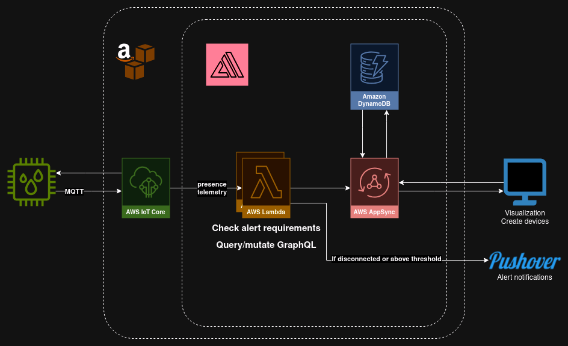

# ENCLOSE
Enclose is an application designed to monitor humidity levels of an enclosure holding 3D-printing materials by displaying real-time reading and giving alert notifications via Pushover if humidity is above a specified threshold.

## Requirements
- A device capable of reading humidity and sending data via MQTT
- AWS enviroment
  - IoT Core
  - Amplify (Amazon S3, DynamoDB, AppSync)

As Amplify handles most of the backend database setup, we won't need to manually set that up.

## Use case
The device, or sensor, is meant to be placed inside of an enclosure holding 3D-printing materials, as a way of monitoring that the humidity levels stays below the recommended levels for a material. As we're monitoring and acting upon the humidity in real-time, by visualizing current levels in Amplify and sending a push notification via Pushover, there's no need as of now for long term storage of telemetry data.

Although if one needed to, for example, check if the humidity fluctuated over a longer period then storing the telemetry data and providing a way of displaying it as a chart in Amplify could be useful. We could relatively easily implement this via IoT Core Rules to forward our telemetry data to DynamoDB. Perhaps even storing years worth of older data in cold storage for use in future tests of material strength or something similar.

But for the current use case, real-time readings by storing the current humidity along with the associated device is good enough.

## Architecture

## Scalability
As the whole "data pipeline" of device telemetry to visualization is setup to work independently of any higher context the system is theoretically infinitely scalable (until the monthly AWS costs starts to skyrocket). Each device has an IoT Core Thing associated with it, and its MQTT client ID is assigned by using the device's MAC address. IoT Core is setup to forward this information to Lambda functions which updates the respective device via DynamoDB setup by Amplify.

One flaw with scalability while doing it like this is that each sensor requires a Thing and communicates directly with AWS, which means requiring AWS setup and transferring certificates over to each device. If one wanted to have 10+ or even 100+ separate enclosures then it could get pretty cumbersome to setup and use more AWS MQTT messages than wanted. One way of mitigating this would be to have a device act as a gateway that locally receives MQTT messages from each device, pools them up, and sends them to AWS at a specified interval. This moves the certification setup process one step down the chain but allows for local control of setup and could mean a reduction in AWS costs.

## Security
The sensor devices uses MQTT with TLS to send data to AWS, using certificates created by AWS. Each part of the pipeline is limited to what it can do by IAM roles and policies that dictate what is allowed and not. As we're using Amplify, these roles are automatically setup for us during deployment, but can be verified to be what they're supposed to via AWS's IAM.

Amplify's functions interact with the backend by using an API key and an endpoint to GraphQL, which are both specified as "secrets" in AWS Amplify, and the access to the frontend is locked behind an account. Devices are "per-user" meaning users cannot add/claim devices that are already assigned to another user. This is a good thing for security (as no one can "steal" a device from another use) but might be a hindrance if two users should be able to both monitor overlapping devices.

## Note
This project was made during the course "IoT och molntjänster" at Nackademin, which was run by Johan Holmberg.
